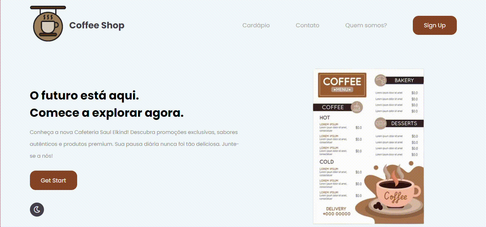

# WebSite LandingPage Coffee Shop ☕

 

 ## * 📃 O que é um Landing Page? 

  Uma landing page é uma página da web projetada com o objetivo específico de converter visitantes em leads ou clientes, geralmente associada a uma campanha de marketing ou promoção. Ela se concentra em uma chamada à ação clara e contém
  informações concisas e persuasivas para incentivar a ação desejada pelo visitante, como preencher um formulário, fazer uma compra ou entrar em contato.

## * 📖 Desrcição

  Projeto de uma landing page para uma cafeteria que hipoteticamente teria aberto pela região e agora está na Web para conseguir mais publicidade.

## * ⚙ Funcionalidade

  A funcionalidade principal de uma landing page para uma cafeteria inclui:
  (Algumas a baixo não estão no projeto, apenas uma descrição do que pode ter futuramente)

  `Apresentação Atraente:`
  Exibir visualmente o ambiente da cafeteria e produtos.
  Destacar ofertas e promoções.
  
  `Informações Essenciais:`
  Fornecer endereço, horário de funcionamento e informações de contato.
  
  `Interatividade do Menu:`
  Apresentar o menu de forma interativa com opções de adicionar ao carrinho.
  
  `Formulário de Contato/Solicitação:`
  Incluir um formulário simples para coletar informações ou reservas.
  
  `Integração de Redes Sociais:`
  Links e feed de mídia social para promover a presença online.
  
  `Avaliações e Depoimentos:`
  Destacar avaliações positivas e depoimentos de clientes.
  Formulário de inscrição para newsletter e promoções futuras.
  

## * 🖼 Imagens e gifs da página

## * 🖥 Tecnologias Utilizadas

| Tipo | Tecnologia |
|------|------------|
| 📄 Marcação | HTML |
| 🖌 Estilização | CSS |
| 💻 Script | Javscript |
| 🎮 controle de versão | GitHub |
| 👨‍💻 Versionamento de código | Git |

## * Fontes consultadas

[Video de Apoio](https://youtu.be/RaITAxEdTDY?si=bAud5fK16Z_TyBKG)
 
[Explicação Landing Page](https://sebrae.com.br/sites/PortalSebrae/artigos/o-que-e-uma-landing-page,3e1e097399323810VgnVCM100000d701210aRCRD)
 
[IA na Ajuda no README](https://openai.com)

## * 👨‍💻 Programador

| [ João Victor Farias](https://github.com/joaovictorgit21)
| :--: |

## * 👨‍🏫 Docente

| [ Leonardo Rocha / Marista](https://github.com/LeonardoRochaMarista)
| :--: |

## * 📒 Matéria
`Programação Web I`